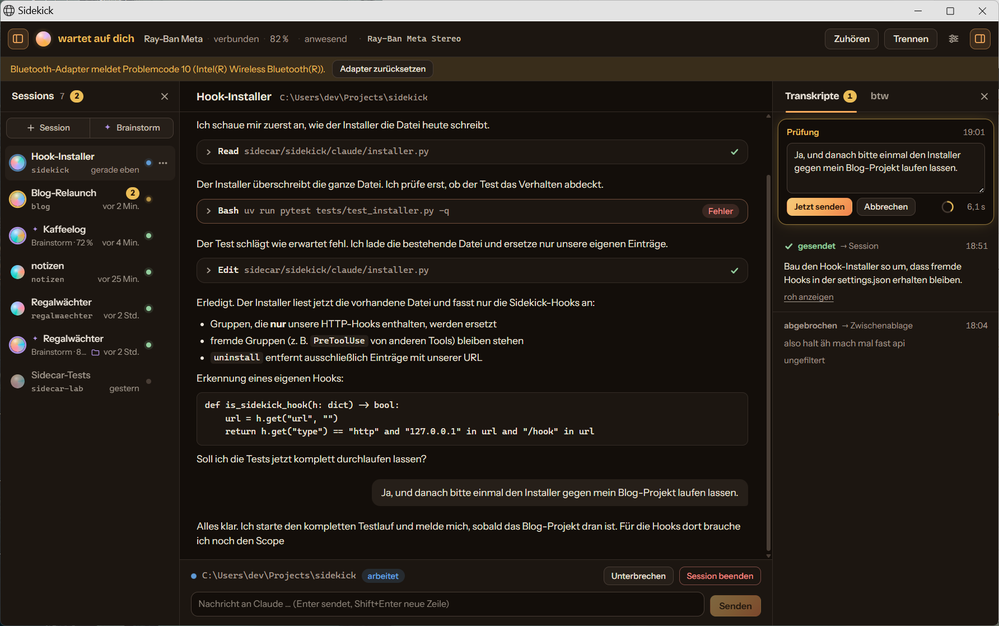

<p align="center">
  
</p>

<h1 align="center">Sidekick</h1>

<p align="center">
  <strong>Your Ray-Ban Meta glasses as a voice interface for Claude Code.</strong><br>
  Tap, talk, walk away. Hear when Claude is done or needs you. Answer by voice. Brainstorm an idea into a ready-to-build project without touching a keyboard.
</p>

<p align="center">
  <a href="LICENSE"></a>
  
  
  
  
  
</p>

<p align="center">
  
</p>

---

Claude Code is great at working for ten minutes on its own. Watching it do that is not. Sidekick turns a pair of Ray-Ban Meta glasses (or any Bluetooth headset, honestly) into ears, a microphone and three buttons for Claude Code, so you can make coffee, pace around or sit on the couch while it builds, and still stay in the loop:

- **A tone and one spoken sentence** when Claude finishes or needs a decision. Haiku condenses the answer, ElevenLabs or Edge reads it.
- **Tap the touchpad and talk.** Silero VAD finds the end of your sentence, Whisper transcribes, Haiku cleans it up (filler words out, `FastAPI` instead of "fast API"), a short review countdown in the UI, then it goes to the session.
- **Answer permissions by voice.** "Yes", "no", "always". Multiple-choice questions from Claude are read out with their options; "the second one" works.
- **Side questions ("btw")** on a separate gesture: Sonnet answers in your ear without interrupting the main session.
- **Brainstorm mode.** Talk an idea through with Opus 5. It asks one question at a time, keeps a live idea board, and when the idea is ready it writes a full project folder (README, spec, plan, decisions, open questions, CLAUDE.md, kickoff prompt), runs `git init` and starts a Claude Code session on milestone one.
- **Several sessions at once**, each its own Claude Code process, persisted and resumable with full history. Sessions from your terminal join through HTTP hooks.

Everything runs locally. Sidekick uses your existing Claude Code login through the Claude Agent SDK, so there is no API key to manage. The only secrets it knows (an optional ElevenLabs key) live in the Windows Credential Manager, never in a config file.

## How it feels

1. Put the glasses on. Sidekick notices they connected, routes Windows audio to them, plays a soft chime.
2. Say what you want built. Tap once, speak, tap again or just stop talking. The transcript appears with a three-second countdown; do nothing and it is sent.
3. Walk away. When Claude wants to run something risky you hear: *"Claude wants to run a command: migrate the database. Allow?"* Say "yes".
4. Ten minutes later: a chime and *"The migration runs, all 42 tests pass. Next it would add the API endpoint."*
5. Double-tap to hear that again. Triple-tap and ask *"btw, which file holds the config?"* and get the answer without touching the session.
6. Lock the screen or leave: audio goes back to your speakers, announcements pause, presence comes back when you do.

## Brainstorm mode

Press **✦ Brainstorm** in the sidebar. No folder needed. You talk (or type), the partner asks exactly one question per turn, proposes two or three options with a recommendation, challenges assumptions, keeps the MVP small and never re-litigates a decision you made. Every reply carries a hidden structured state that the UI shows live in the **Idea** tab: title, one-liner, problem, users, core features, non-goals, stack, decisions, open questions, next steps and a readiness score. At 80 the partner says it has enough.

**Create project** then generates, in parallel with Opus 5, one file per call:

```
my-idea/
├── README.md              vision, problem, users, MVP, non-goals, stack, status
├── CLAUDE.md              working instructions for Claude Code in this folder
├── .gitignore
└── docs/
    ├── SPEC.md            features with acceptance criteria, flows, data model, edge cases
    ├── PLAN.md            milestones; milestone 1 is always a running walking skeleton
    ├── DECISIONS.md       ADR-style decisions with rationale
    ├── OPEN_QUESTIONS.md  each with a default assumption and "blocks milestone 1?"
    ├── KICKOFF.md         the prompt that starts the first session
    └── BRAINSTORM.md      the whole conversation, so nothing is lost
```

Then `git init`, an initial commit, and (optionally) a Claude Code session in that folder that receives the kickoff prompt: read the docs, build milestone one, only ask about blocking open questions, commit in small steps. A file that fails twice becomes a placeholder; the rest still lands. Live-tested: three spoken rounds at about 7 s each took an idea from readiness 30 to 85, and eight documents plus git were on disk 81 s after pressing the button.

## Architecture

```
┌──────────────────┐   Bluetooth (A2DP / HFP)   ┌────────────────────────────────────────────┐
│  Ray-Ban Meta    │ ◄────────────────────────► │  Windows                                   │
│  audio + touchpad│      media keys            │                                            │
└──────────────────┘                            │  ┌──────────────┐  REST + WebSocket  ┌────┐│
                                                │  │ Python       │ ◄────────────────► │Vue ││
   claude (terminal) ── HTTP hooks ───────────► │  │ sidecar      │    :47821          │ UI ││
                                                │  │ FastAPI      │                    └────┘│
                                                │  │              │  Claude Agent SDK   Tauri │
                                                │  │ audio, VAD,  │ ◄──────────────►  shell,  │
                                                │  │ STT, TTS,    │   claude.exe ×N    tray,  │
                                                │  │ presence,    │   (your login)   autostart│
                                                │  │ gestures     │                           │
                                                │  └──────────────┘                           │
                                                └────────────────────────────────────────────┘
```

| Part | What it does |
|---|---|
| `sidecar/` | Python 3.12, FastAPI on a fixed local port. Owns all state: audio routing (pycaw + IPolicyConfig), WASAPI capture and playback, Silero VAD (ONNX), faster-whisper, TTS with a fallback chain, presence (lock, idle, Bluetooth), the low-level media-key hook, the Claude Agent SDK sessions, hooks from terminal sessions, SQLite persistence, `config.toml`. |
| `src/` | Vue 3 + Pinia + Vite UI. Sessions sidebar, live transcript with streaming, tool calls, permission and question cards, idea board, settings, gesture tester. Dark and light theme. |
| `src-tauri/` | Tauri 2 shell: window, tray with four states, autostart, single instance, supervises the sidecar. |

The REST and WebSocket contract lives in [`docs/superpowers/plans/2026-09-07-sidekick.md`](docs/superpowers/plans/2026-09-07-sidekick.md); design decisions and the facts we validated on real hardware in [`docs/superpowers/specs/`](docs/superpowers/specs/).

## Requirements

- Windows 11. Ray-Ban Meta glasses paired as a Bluetooth headset (the device name is configurable; any headset with media keys works, you just lose the glasses-specific defaults).
- [Claude Code](https://code.claude.com) installed and logged in (Pro or Max). Sidekick reuses that login; no API key.
- To build: [uv](https://docs.astral.sh/uv/), Node 22 with pnpm, Rust with the MSVC toolchain (see the GNU note below if you do not have Visual Studio Build Tools), WebView2 (ships with Windows 11).
- Optional: an ElevenLabs key for the nicer voice. Without it Sidekick speaks through Edge TTS.

## Quick start

```bash
git clone https://github.com/lennystepn-hue/sidekick.git
cd sidekick
pnpm install
cd sidecar && uv sync && cd ..
pnpm tauri dev          # Vite + the Tauri window + the sidecar
```

Useful on its own:

```bash
cd sidecar && uv run python -m sidekick --fake    # sidecar only, glasses simulated
pnpm dev                                          # UI only, then open http://localhost:1420/?demo=1
cd sidecar && uv run pytest -q                    # 116 tests, no hardware, no network
pnpm typecheck
```

### Install as a desktop app

```powershell
pwsh scripts/install-portable.ps1
```

Builds the release exe and the packaged sidecar (PyInstaller), copies both to `%LOCALAPPDATA%\Programs\Sidekick` and puts two shortcuts on the desktop: **Sidekick** (a second click just focuses the running window) and **Sidekick neu starten** (kills every running instance and starts fresh). Re-run after changes; `-SkipSidecar` or `-SkipBuild` when only one side changed. MSI/NSIS bundles: `pnpm tauri build --config src-tauri/tauri.release.conf.json` after `pwsh sidecar/tools/build_sidecar.ps1`.

## Using it

### Gestures (defaults, editable in Settings)

| Glasses | Media key | Action |
|---|---|---|
| Single tap | Play/Pause | Start listening; a second tap ends the recording |
| Double tap | Next | Repeat the last announcement, interrupting current speech |
| Triple tap | Previous | Side question (btw) |
| Hold | Stop | Side question (btw), if Windows delivers the event |

The gesture tester in Settings shows every raw media event, so you can find out on day one which gestures your firmware actually sends. While the glasses are connected, media keys are swallowed so Spotify does not join in.

### Voice answers

When Claude asks for permission, "yes", "no" and "always" (in German or English) resolve it. For multiple-choice questions, name the option or its position. Anything else is sent as text, which is how you answer free-form questions.

### Sessions

The left sidebar lists every session. Several can run at once, each with its own Claude Code process; voice and transcript always go to the **active** one, and when more than one is running the announcement names the session first. Sessions persist in SQLite with their Claude Code session id, so a stopped session resumes with its full history. The title comes from the first message (or from the idea title in a brainstorm) and can be renamed.

Permission mode defaults to Claude Code's **auto** mode (Claude decides, asks only for risky actions); "accept edits", "always ask" and "never ask" are one dropdown away and apply to running sessions immediately.

### Terminal sessions

Settings → Hooks → pick a project → Install. That writes six HTTP hooks (`Stop`, `Notification`, `PermissionRequest`, `UserPromptSubmit`, `SessionStart`, `SessionEnd`) into the chosen `settings.json`, pointing at `http://127.0.0.1:47821/hook/<Event>`. Existing hooks are left alone; uninstall removes only Sidekick's. From then on your terminal sessions announce completions and questions on the glasses. Spoken text for those sessions lands in the clipboard (optionally typed straight into the terminal via SendInput). The JSON is shown in the UI if you prefer pasting it yourself.

### Audio and presence

The glasses are a normal Bluetooth headset to Windows: A2DP for good playback, HFP for the microphone. Sidekick keeps A2DP as the default output, switches to HFP only while listening, and switches back afterwards, so music quality is never degraded by the mic. Presence is derived from screen lock, input idle time and the Bluetooth connection: when you leave, output goes back to the previous device; when you are back, it routes to the glasses again and chimes. A tray icon shows the state at a glance.

## Configuration

`%APPDATA%\Sidekick\config.toml`, fully editable in the UI. Unknown keys are preserved, so hand edits survive.

| Section | Highlights |
|---|---|
| `audio` | device name to look for, restore the previous output device, tone volume |
| `stt` | engine and model (`faster-whisper` `small` int8 by default), silence and max duration, languages, hotwords, review delay, cleanup on/off |
| `tts` | `elevenlabs` or `edge`, voice, summarize before speaking |
| `gestures` | mapping of single/double/triple/hold, capture media keys |
| `claude` | models for cleanup, summary and btw, permission mode, CLI path |
| `brainstorm` | partner and docs model (Opus 5), speak replies, auto-listen after a reply, thinking |
| `projects` | base folder for created projects (`~/Projects`), git init, start session after create |
| `delivery` | clipboard and SendInput for terminal sessions |
| `presence` | idle threshold, auto-connect, poll interval |

Data: `%APPDATA%\Sidekick\sidekick.db` (sessions, messages, transcripts, btw), `models\` (Whisper), `brainstorms\` (scratch folders), `logs\sidecar.log`. Nothing leaves your machine except the model calls that go through your Claude login and, if enabled, ElevenLabs.

## Design

Warm, tinted neutrals with an amber accent; Bricolage Grotesque for titles, Instrument Sans for text, monospace only for code. Every session gets its own deterministic gradient orb, and the "Aura" in the header is Sidekick's living orb: it turns slowly, breathes while speaking, pulses while listening, turns golden while waiting for you and blooms once when Claude is done. Dark, light and system themes; reduced motion is honoured. Context and audits: [`.impeccable.md`](.impeccable.md), [`docs/design/`](docs/design/).

## Roadmap

Next up, in this order:

1. **Parakeet TDT 0.6B v3** as the local speech engine (25 European languages, int8 ONNX on the runtime we already ship), for transcripts in well under a second instead of 0.7× real time.
2. **Adopt terminal sessions** into Sidekick with one click (we know their ids from the hooks), a "later" answer for permissions, and a quiet period after your own input.
3. **A Sidekick channel** for Claude Code's channels preview: push voice straight into terminal sessions and relay their permission prompts to the glasses, plus a launcher for terminal sessions with Remote Control so the phone can steer what the glasses announce.

Ideas that did not make the cut, and why, are in [`docs/superpowers/specs/2026-09-07-sidekick-design.md`](docs/superpowers/specs/2026-09-07-sidekick-design.md).

## Known limits

- The glasses' camera and capture button are not reachable on Windows; Meta's Device Access Toolkit is iOS and Android only.
- While the HFP microphone is open, audio quality drops to phone level. That is why the mic is only open while listening.
- Whisper `small` on CPU runs at about 0.7× real time; `base` is faster and fine for short instructions (Parakeet is coming, see the roadmap).
- Intel AX200-class Bluetooth adapters sometimes fall into Code 10 after long uptimes. The UI shows a banner with a one-click `pnputil /restart-device` (UAC prompt); if that does not help, a full power-off cycle does.
- Audio is always opened in WASAPI shared mode with automatic conversion, so 44.1 kHz tones and 24 kHz speech play cleanly on a 48 kHz endpoint. If the log says `seamless resampling`, the device refused conversion and Sidekick resamples itself.
- If you ever see `Failed to start Claude Code: [WinError 50]` from a packaged build: claude.exe was trying to inherit the sidecar's stderr handle, which does not work under Tauri. Every `ClaudeAgentOptions` now sets a `stderr` callback so the SDK pipes it instead.
- No wake word, no Deepgram, no macOS or Linux (yet).

## Building without Visual Studio Build Tools

This repo pins the `x86_64-pc-windows-gnu` toolchain in `src-tauri/rust-toolchain.toml` and points `.cargo/config.toml` at MSYS2 binutils (`C:\msys64\mingw64\bin`, packages `mingw-w64-x86_64-binutils` and `mingw-w64-x86_64-gcc`). With the GNU build, `WebView2Loader.dll` must sit next to the exe; the install script copies it. If you have "Desktop development with C++" installed, delete both files and Tauri builds with MSVC as usual.

## Contributing

Issues and pull requests are welcome. The sidecar is tested without hardware (`uv run pytest -q`, `uv run ruff check`), the UI with `pnpm typecheck` and `pnpm build`; a demo mode (`?demo=1`) drives the whole UI with fake data. The original German product spec is in [`rayban-companion-spec.md`](rayban-companion-spec.md).

## License

[MIT](LICENSE).
